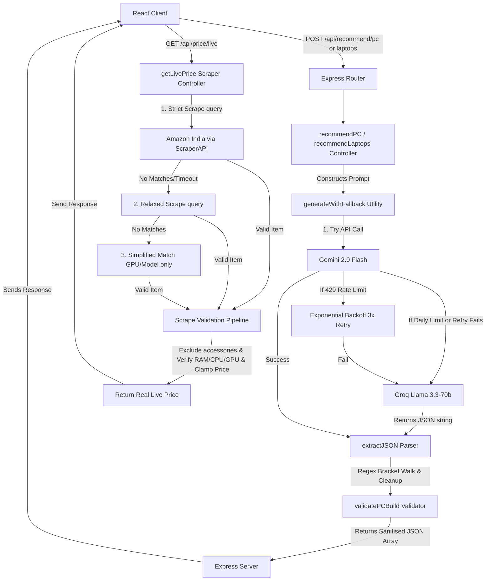

# ChipChart AI - Backend Logical Architecture Study Guide 🧠⚙️

This document is a deep-dive into the backend architecture of ChipChart AI (`server/`). It outlines the logic, flow patterns, algorithms, and design choices. It is structured specifically for SDE placement preparation, focusing on system resilience, web scraping heuristics, and API proxy patterns.

---

## 1. System Flow Architecture



---

## 2. Core Backend Modules & Logic

### A. Dual-Provider Resilient LLM pipeline (`server/utils.js` -> `generateWithFallback`)
To avoid hitting Google Gemini API limits or system errors that could break the client, the backend operates a **resilient dual-LLM failover pipeline**:

1. **Phase 1 (Gemini Execution)**: The server queries the primary model, **Gemini 2.0 Flash**.
2. **Phase 2 (Transient Error Handling)**: If a `429 (Too Many Requests)` rate-limiting error occurs, the code uses an exponential backoff retry system. It retries up to **3 times** with escalating delays: **3,000ms**, **7,000ms**, and **15,000ms**.
3. **Phase 3 (Fallback Execution)**: If the Gemini API reports a daily quota exhaustion (`Quota exceeded`), or if the 3 retries fail, it catches the exception and routes the exact prompt payload to **Groq API (`Llama 3.3-70b-versatile`)** using a standard Node `fetch` request.

---

### B. Heuristic Web Scraper Validation Pipeline (`server/utils.js` -> `scrape`)
Raw search results from Amazon India are extremely noisy. A search for `"Asus ROG Strix Laptop"` will return cases, charging bricks, keyboards, and stands. To prevent these from skewing prices, the backend passes each scraped item through a **5-Step Validation Pipeline**:

1. **Availability Filter (`isUnavailable`)**: Filters out items marked as "out of stock," "currently unavailable," or those returning a zero price.
2. **Category Filter (`isActualLaptop`)**: Rejects listings containing accessory keywords (e.g., *sleeve, stand, adapter, desktop, only gpu*) and verifies the presence of notebook signals (*Victus, ThinkPad, ZenBook, MacBook*).
3. **Brand Validation (`brandOk`)**: Computes case-insensitive matching. If a model is provided, it splits the string into words and ensures at least 2 words match the listing title to prevent incorrect product matching.
4. **Specs Verification (`specsOk`)**: Uses regular expressions to extract key hardware categories:
   * **GPU Match**: Matches patterns like `\b(rtx\s*\d{4})\b` or `\b(radeon\s*\w+)\b` to confirm the graphics card model is present in the title.
   * **CPU Match**: Matches patterns like `\b(i[3579])\b` or `\b(ryzen\s*[3579])\b` to verify the CPU series.
   * **RAM Match**: Parses memory capacity (e.g., `16GB`) to ensure it aligns.
5. **Price Clamping & Sanity Check (`priceSane`)**: Clamps the price of the live listing to a window of **40% to 160%** of the AI-estimated price. If a laptop is estimated at ₹1,00,000, and a listing matches for ₹5,000, it is discarded (it is likely a laptop charger or skin).

---

### C. Advanced JSON Boundary Extraction Parser (`server/utils.js` -> `extractJSON`)
LLMs often wrap JSON arrays in markdown block code syntax (e.g., ` ```json ... ``` `) or return conversational preambles like *"Here is your JSON:"*. To make the parser robust, we implemented a custom bracket-matching string parser:

* **The Logic**: The parser locates the first `[` character. It then performs a character-by-character scan, tracking:
  * String bounds (`inString` toggled by `"`) to prevent matching bracket characters nested inside text strings.
  * Escape sequences (`isEscaping` toggled by `\`) to ignore escaped quotes (`\"`).
  * Nested array depth (`depth` incremented on `[` and decremented on `]`).
* When `depth` returns to `0`, the matching boundary index `end` is discovered.
* The script extracts the substring, cleans up trailing commas via regex, and parses it securely, preventing standard `JSON.parse` failures.

---

## 3. High-Yield Placement Interview Q&A

### Q1: "How did you design a resilient architecture for your AI recommendation feature?"
> **Answer**: *"I implemented a dual-provider fallback system in Node.js. The server defaults to the Google Gemini 2.0 Flash model. If a transient 429 rate limit is encountered, the backend uses exponential backoff to retry up to 3 times. If the daily API quota is exhausted, the server catches the exception and immediately redirects the prompt payload to Llama 3.3 via Groq. This ensures the app is highly available and never breaks for the user."*

### Q2: "Web scraped data from e-commerce sites is often very noisy. How did you sanitize it?"
> **Answer**: *"I built a 5-step heuristic validation pipeline. When scraping Amazon India, I filter out unavailable items, verify the brand, and run regular expression matches to confirm core specs like CPU, GPU, and RAM capacity. To eliminate accessories like bags or chargers, I use a keyword exclusion list and a price clamping heuristic that rejects listings priced below 40% or above 160% of the AI's estimate."*

### Q3: "What is a JSON parser exception, and how did you resolve it when working with LLM responses?"
> **Answer**: *"LLMs sometimes append conversational text before/after their output or output trailing commas in objects, which crashes standard `JSON.parse()`. I wrote a custom boundary parser that walks the characters, tracking escape sequences and quote contexts to identify the precise outermost array bracket boundaries. It cleans up invalid trailing commas using regex before passing the string to the native parser, eliminating JSON parsing exceptions."*

---

## 4. Key Specs Verification Regex Reference (Memorize for Interviews)

| Tech Item | Regular Expression | Matches |
|---|---|---|
| **Intel CPU** | `/\b(i[3579])\b/` | `i5`, `i7`, `i9` |
| **AMD Ryzen** | `/\b(ryzen\s*[3579])\b/` | `Ryzen 5`, `ryzen7` |
| **Nvidia GPU** | `/\b(rtx\s*\d{4})\b/` | `rtx 4060`, `RTX 3070` |
| **AMD GPU** | `/\b(radeon\s*\w+)\b/` | `Radeon RX7600M` |
| **RAM** | `/\b(\d+)\s*gb\b/` | `16GB`, `8 gb` |
